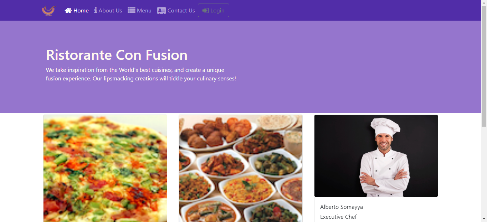
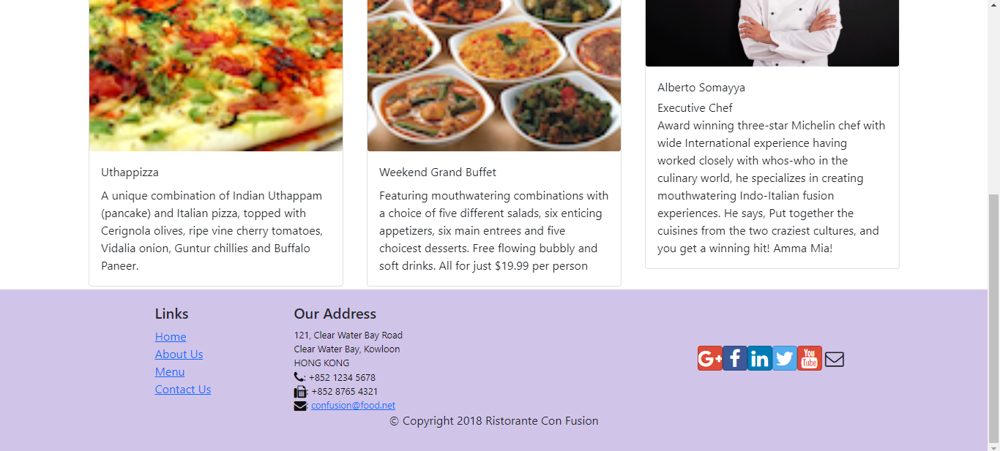
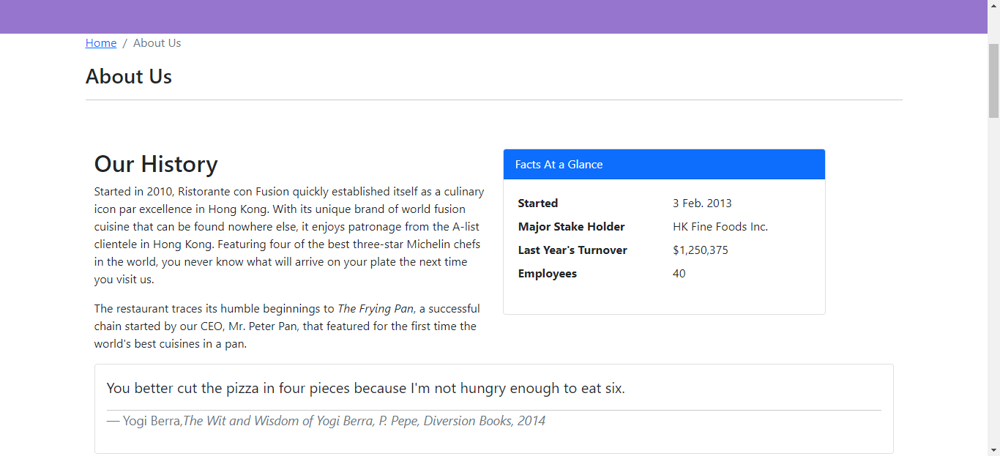
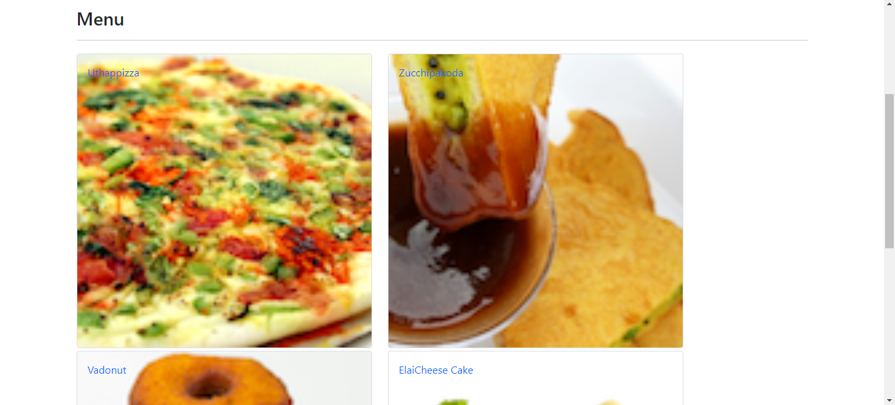
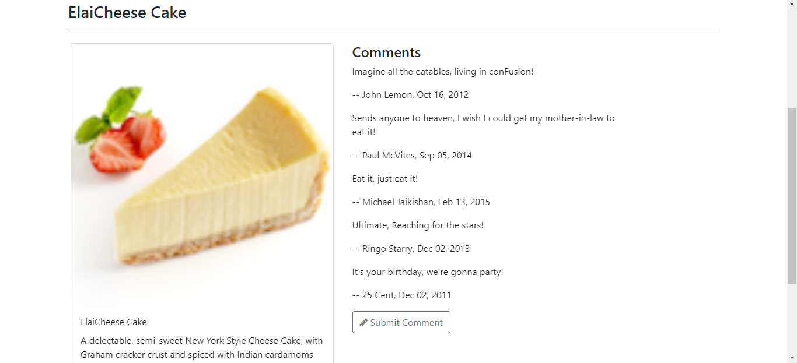

# Ristorante-Con-Fusion

## Available Scripts

In the project directory, you can run:

cd Application

### `npm start`

Runs the app in the development mode.\
Open [http://localhost:3000](http://localhost:3000) to view it in the browser.

The page will reload if you make edits.\
You will also see any lint errors in the console.

cd json-server

### `json-server --watch db.json --port 3001`

Launches the test runner in the interactive watch mode.\
See the section about [running tests](https://facebook.github.io/create-react-app/docs/running-tests) for more information.
